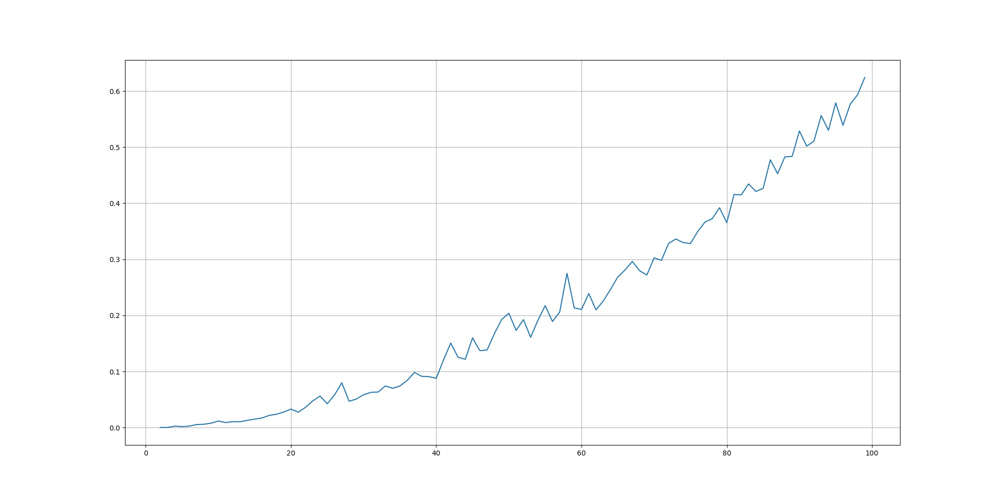

# Elliptic Curve Factorization
[](https://pypi.org/project/pyecf/)

Данный модуль предназначен для нахождения всех делителей числа 
(факторизация, разложение на простые множители). В качестве метода факторизации
используется [алгоритм](https://wstein.org/edu/124/lenstra/lenstra.pdf), предложенный Хендриком Ленстрой в 1987 году.

## Использование через командную строку
Для использования в терминале достаточно установить пакет:
```shell
git clone https://github.com/NikitaYurasov/ECF.git
cd ECF
```
И выполнить следующую команду:
```shell
python pyecf -n 9671406556917033397649407
```

## Использование в Python
Пакет выложен на PyPi, так что достаточно просто установить его через *pip*:
```shell
pip install pyecf
```
Внутри проекта использование может выглядеть так:
```python
from pyecf import LenstraAlgorithm

n = 9671406556917033397649407
algo = LenstraAlgorithm(n)
factors = algo.factorize() # factors - отсортированный список делителей
```

## Описание алгоритма

Пусть требуется найти делить числа <a href="https://www.codecogs.com/eqnedit.php?latex=n" target="_blank"></a>. Считаем, что у числа <a href="https://www.codecogs.com/eqnedit.php?latex=n" target="_blank"></a> существует делитель <a href="https://www.codecogs.com/eqnedit.php?latex=d" target="_blank"></a> (<a href="https://www.codecogs.com/eqnedit.php?latex=1<d<n" target="_blank"></a>). Сгенерируем тройку чисел <a href="https://www.codecogs.com/eqnedit.php?latex=a,&space;x_0,&space;y_0" target="_blank"></a> для случайной эллиптической кривой <a href="https://www.codecogs.com/eqnedit.php?latex=y^2=x^3&plus;ax&plus;b" target="_blank"></a> над <a href="https://www.codecogs.com/eqnedit.php?latex=Z/nZ" target="_blank"></a>, где <a href="https://www.codecogs.com/eqnedit.php?latex=b&space;=&space;y_0^2&space;-&space;x_0^3-ax&space;\mod&space;n" target="_blank"></a> и с условием, что кривая не сингулярна (<a href="https://www.codecogs.com/eqnedit.php?latex=4a^3&plus;27b^2\ne&space;0\mod&space;n" target="_blank"></a>). Случайной точкой на кривой выберем <a href="https://www.codecogs.com/eqnedit.php?latex=P(x&space;:&space;y)&space;=&space;(x_0&space;:&space;y_0)" target="_blank"></a>. 

Пусть также задано число <a href="https://www.codecogs.com/eqnedit.php?latex=k" target="_blank"></a>, обозначающее степень, в которое будем возводить начальную точку <a href="https://www.codecogs.com/eqnedit.php?latex=P" target="_blank"></a>: <a href="https://www.codecogs.com/eqnedit.php?latex=k=\prod\limits_{r=2}^{\omega}r^m" target="_blank"></a>, где <a href="https://www.codecogs.com/eqnedit.php?latex=r^m\leq&space;\nu&plus;2\sqrt{\nu}&plus;1" target="_blank"></a> и <a href="https://www.codecogs.com/eqnedit.php?latex=r" target="_blank"></a> -- некоторые целые положительные числа.

Следующим шагом выполняется возведение в степень на выбранной кривой:

<a href="https://www.codecogs.com/eqnedit.php?latex=kP&space;=&space;\underbrace{P&plus;&space;P&plus;&space;....&space;&plus;&space;P}_k" target="_blank"></a>, где операция + определена по следующему алгоритму:
### Алгоритм сложения
Требуется сложить две точки <a href="https://www.codecogs.com/eqnedit.php?latex=P" target="_blank"></a> и <a href="https://www.codecogs.com/eqnedit.php?latex=Q" target="_blank"></a>: <a href="https://www.codecogs.com/eqnedit.php?latex=R=P&plus;Q" target="_blank"></a>

1. Если <a href="https://www.codecogs.com/eqnedit.php?latex=P=\mathcal{O}" target="_blank"></a>, то <a href="https://www.codecogs.com/eqnedit.php?latex=R=Q" target="_blank"></a>; если <a href="https://www.codecogs.com/eqnedit.php?latex=Q=\mathcal{O}" target="_blank"></a>, то <a href="https://www.codecogs.com/eqnedit.php?latex=R=P" target="_blank"></a>.
2. Иначе, пусть <a href="https://www.codecogs.com/eqnedit.php?latex=P=(x_1,&space;y_1),&space;Q=(x_2,&space;y_2)" target="_blank"></a>
    a. Найти <a href="https://www.codecogs.com/eqnedit.php?latex=d=\gcd(x_1-x_2,&space;n)" target="_blank"></a>. Если <a href="https://www.codecogs.com/eqnedit.php?latex=1<d<n" target="_blank"></a>, то <a href="https://www.codecogs.com/eqnedit.php?latex=d" target="_blank"></a> -- делитель <a href="https://www.codecogs.com/eqnedit.php?latex=n" target="_blank"></a>. Конец алгоритма.
    b. Если <a href="https://www.codecogs.com/eqnedit.php?latex=d=1" target="_blank"></a>, то НОД дает <a href="https://www.codecogs.com/eqnedit.php?latex=(x_1-x_2)^{-1}" target="_blank"></a>
        <a href="https://www.codecogs.com/eqnedit.php?latex=\lambda=(y_1-y_2)(x_1-x_2)^{-1}" target="_blank"></a>
        <a href="https://www.codecogs.com/eqnedit.php?latex=x_3=\lambda^2-x_1-x_2;\:&space;y_3=\lambda(x_1-x_3)-y_1" target="_blank"></a>
        <a href="https://www.codecogs.com/eqnedit.php?latex=R=(x_3,&space;y_3)" target="_blank"></a>
        Конец алгоритма.
    c. Если <a href="https://www.codecogs.com/eqnedit.php?latex=d=n" target="_blank"></a>, тогда <a href="https://www.codecogs.com/eqnedit.php?latex=x_1=x_2" target="_blank"></a>. Требуется найти <a href="https://www.codecogs.com/eqnedit.php?latex=d=\gcd(y_1&space;&plus;&space;y_2,&space;n)" target="_blank"></a>. 
    - Если <a href="https://www.codecogs.com/eqnedit.php?latex=1<d<n" target="_blank"></a>, <a href="https://www.codecogs.com/eqnedit.php?latex=d" target="_blank"></a> -- делитель, конец алгоритма. 
    - В противном случае, если <a href="https://www.codecogs.com/eqnedit.php?latex=d=n" target="_blank"></a>, считаем, что <a href="https://www.codecogs.com/eqnedit.php?latex=R=\mathcal{O}" target="_blank"></a>, конец алгоритма.
    - Если <a href="https://www.codecogs.com/eqnedit.php?latex=d=1" target="_blank"></a>, то <a href="https://www.codecogs.com/eqnedit.php?latex=\lambda=(3x_1^2&plus;a)(y_1&plus;y_2)^{-1}" target="_blank"></a> и <a href="https://www.codecogs.com/eqnedit.php?latex=R=(\lambda^2-x_1-x_2,&space;\lambda(x_1-x_3)-y_1)" target="_blank"></a>.
    
Стоит заметить, что если в ходе алгоритма получается сингулярная кривая, выбор кривой необходимо повторить. Если в ходе алгоритма делитель не нашелся, алгоритм стоит запустить еще раз.


### Нахождение всех делителей числа

1. Пусть заданы два массива: пустой массив для простых делителей и массив с составными делителями. 
   На первом шаге, во втором массиве находится число <a href="https://www.codecogs.com/eqnedit.php?latex=n" target="_blank"></a>.
   
2. По всем числам из массива составных делителей пока он не пустой:
    - Берем первое число;
    - Проверяем на простату (тест Миллера-Рабина): если число простое, заносим его в массив
    простых чисел, и удаляем первое число из массива составных чисел;
    - Если не простое, проверяем на четность: если число четное, в список простых делителей заносим
    2, в список составных - <a href="https://www.codecogs.com/eqnedit.php?latex=n/2" target="_blank"></a> в конец;
    - Если не четное, аналогично проверяем делимость на 3;
    - В противном случае используем алгоритм Ленстры для поиска делителя, пока он не будет найден. 
      Когда делитель найден, добавляем его и <a href="https://www.codecogs.com/eqnedit.php?latex=n/d" target="_blank"></a> в список составных делителей в конец.
      
3. Результатом алгоритма будут все числа из списка простых делителей.


### Скорость работы
Время работы данного алгоритма зависит не от самого факторизуемого числа, а то размера наименьшего делителя.

Время работы:

